# churn_telecom_prediction
## Abstract
## Project objectives
## Analysis workflow
### 1. Data overview
The dataset is sourced from Kaggle competition [Customer Churn Prediction 2020](https://kaggle.com/competitions/customer-churn-prediction-2020) which published by Kostas Diamantaras. Although this project is not a formal submission to the competition, the data was used for independent exploration and model development.

The data simulates customer information from a telecommunications company. The goal is to predict whether a customer will churn ("yes") or retain ("no"). 

Two datasets are used:
- "train.csv": for training and model selection
- "test.csv": for evaluating model performance and generating churn predictions

Each record contains customer-level features such as service plans, call activity and historical interactions. The target variable is named "churn".
### 2. Data preparation
The "train.csv" dataset was used for data preparation. There was no missing values detected in the data. Categorical variables including "international_plan", "voice_mail_plan" and "churn" were converted to numeric format, where "yes" into 1 and "no" into 0. The "area_code" variable was processed to extract the numeric portion (e.g., 415) into a new column called "area_code_num". Removed non-numeric features from the dataset, such as, "state", "area_code", "international_plan", "voice_mail_plan" and "churn". 

A statistical summary was generated for all numerical features to check data scale and distributions. A correlation heatmap was conducted to examine multicollinearity, as shown in Figure 1. Several variable pairs showed perfect correlation with 1, particularly between usage and charge features such as "minutes-variables vs charge-variables". The "voice_mail_plan_num" was retained for modeling to avoid feature redundancy due to the high correlation (0.95) between "number_vmail_messages" and "voice_mail_plan_num". The cleaned dataset was finalized with selected input variables (X) and the binary target variable (Y = "churn_num").

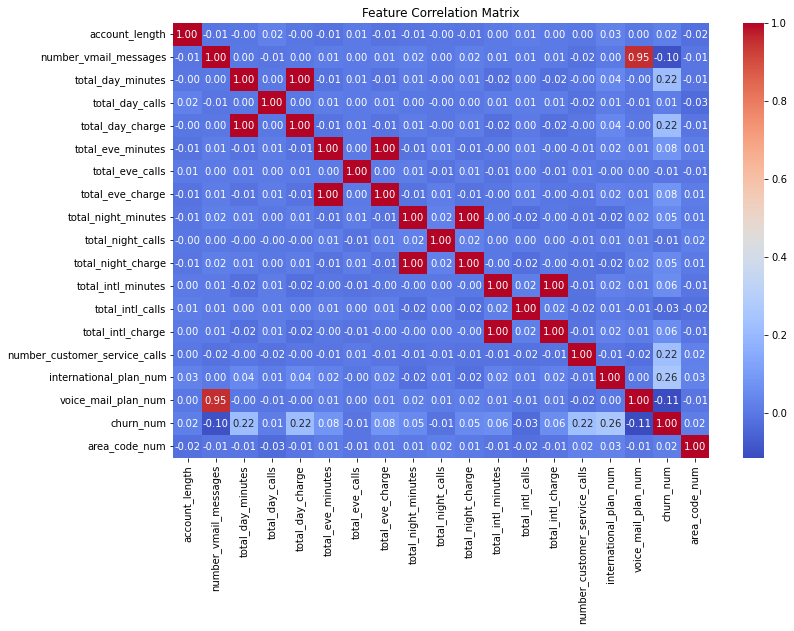

Figure 1. Correlation Heatmap for Selected Features

Before model training, the dataset was split into training and testing sets, with 30% of the data reserved for testing. Stratified sampling was applied to maintain the original class distribution in both sets.  5-fold cross-validation was prepared on the training set. This setup allows each model to be trained and validated across different data splits, providing a more reliable assessment of performance before final testing.
### 3. Modeling

### 3.1 Lasso Logistic Regression
Two Lasso logistic regression models were evaluated. Figure 2 shows the relationship between the number of selected predictors and the regularization strength (log(lambda)). As regularization increased, fewer predictors were retained. Lambda1SE corresponded to a simpler model with fewer features, compared to LambdaMinDev. Figure 3 displays the cross-validated deviance across different values of log(lambda). The Lambda1SE model achieved a deviance that was close to the minimum, but with greater model parsimony. Considering the trade-off between model complexity and predictive accuracy, the Lambda1SE model was selected for final evaluation and testing.

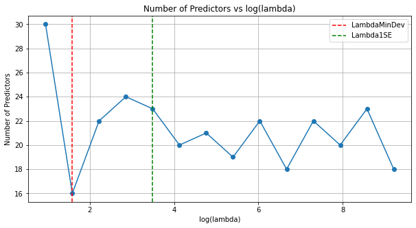

Figure 2. Number of Predictors vs log(lambda)

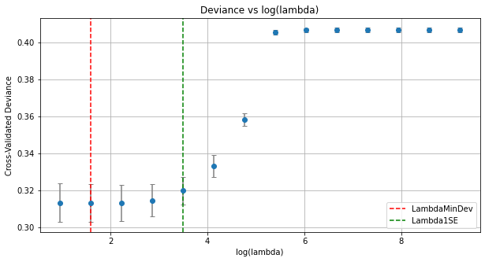

Figure 3. Deviance vs log(lambda)

The selected Lasso logistic regression model (Lambda1SE) was evaluated on the test set. Figure 4 displays the ROC curve, with an area under the curve (AUC) of 0.8118. The model achieved a strong ability to distinguish between churned and retained customers. The optimal classification threshold was identified at approximately 0.124, balancing sensitivity and specificity. The confusion matrix in Figure 5 illustrates the classification results. The model correctly predicted 753 non-churned customers and 151 churned customers. Table 2 summarizes the final performance metrics. The model achieved an accuracy of 0.709, an AUC of 0.8118, and an F1 score of 0.4487. 

Table 1. Cross-Validation Results of Lasso Logistic Regression
| Metric            |   Value |
|-------------------|---------|
| AUC               |  0.8118 |
| Optimal FPR       |  0.313  |
| Optimal TPR       |  0.8436 |
| Optimal Threshold |  0.124  |

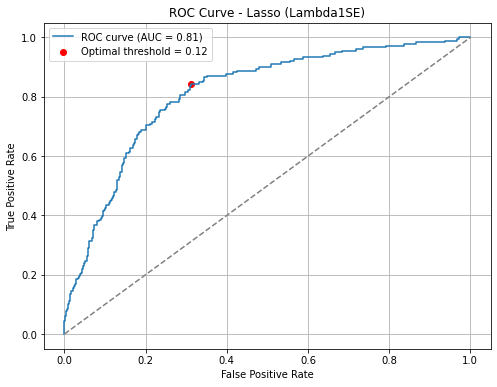

Figure 4. ROC Curve of Lasso Logistic Regression

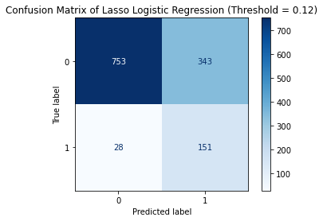

Figure 5. Confusion Matrix of Lasso Logistic Regression

Table 2. Evaluation of Logsitic Regression
| Metric   |   Logistic regression |
|----------|-----------------------|
| Accuracy |                0.709  |
| AUC      |                0.8118 |
| F1 Score |                0.4487 |

### 3.2 Supoort Vector Machine (SVM)

Two SVM models were trained and evaluated using 5-fold cross-validation. Table 3 reports the cross-validated accuracy for both models. The polynomial kernel SVM achieved slightly higher accuracy (0.9123) compared to the RBF kernel SVM (0.9113). Therefore the best SVM model selected polynomial SVM model.Figure 6 shows the confusion matrix, highlighting the classification performance. Table 4 summarizes the key evaluation metrics. The polynomial SVM achieved an accuracy of 0.9137, an AUC of 0.8789, and an F1 score of 0.6207. 

Table 3. Cross-Validation Accuracy of SVM Models
| Model          |   Accuracy |
|----------------|------------|
| SVM RBF        |     0.9113 |
| SVM Polynomial |     0.9123 |

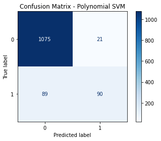

Figure 6. Confusion Matrix of SVM

Table 4. Evaluation Metrics of Polynomial SVM
| Metric   |    SVM |
|----------|--------|
| Accuracy | 0.9137 |
| AUC      | 0.8789 |
| F1 Score | 0.6207 |

### 3.3 Classification Tree
A decision tree classifier was trained with different values of minimum leaf size to explore model complexity and generalization performance. Figure 7 shows the cross-validated accuracy across a range of leaf sizes. As the leaf size increased, model complexity decreased and accuracy declined accordingly. The optimal performance was achieved at a leaf size of 13, with a cross-validated accuracy of 0.9408, as shown in Table 5. 

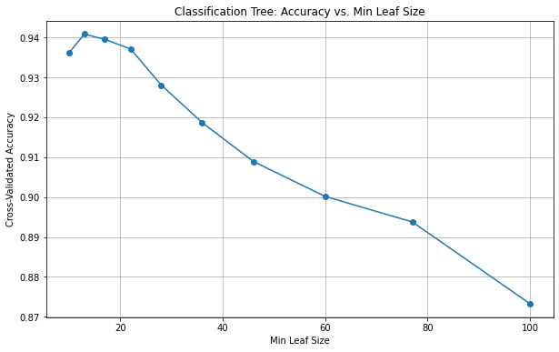

Figure 7. Accuracy vs. Minimum Leaf Size in Classification Tree

Table 5. Optimal Leaf Size and Accuracy of Classification Tree
| Summary           |   Value |
|-------------------|---------|
| Optimal leaf size | 13      |
| Optimal accuracy  |  0.9408 |

The final model was retrained using this optimal leaf size and evaluated on the test set. The confusion matrix is presented in Figure 8. Evaluation results are summarized in Table 6. The classification tree achieved an accuracy of 0.9349 and an F1 score of 0.7566. However, the AUC was notably lower (0.5716) compared to other models, indicating that the model may lack discrimination power despite its high overall accuracy.

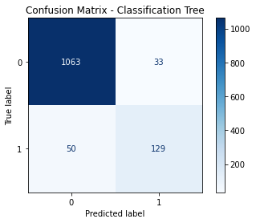

Figure 8. Confusion Matrix of Classification Tree

Table 6. Evaluation Metrics of Classification Tree
| Metric   |   Classification |
|----------|------------------|
| Accuracy |           0.9349 |
| AUC      |           0.5716 |
| F1 Score |           0.7566 |

### 3.4 Model Evaluation
Model performance was compared across Lasso logistic regression, SVM with polynomial kernel, and classification tree models. Figure 9 presents the ROC curves for all models. The SVM model demonstrated the highest AUC, indicating superior ability to distinguish between churned and retained customers. Figure 10 summarizes the accuracy, AUC, and F1 score for each model. While the classification tree achieved the highest accuracy, it exhibited a relatively low AUC, suggesting weaker discrimination capability. Lasso logistic regression showed balanced but moderate performance across all metrics. The SVM model consistently achieved the best overall results, with strong AUC and F1 score, and was therefore selected as the final model for churn prediction on the test dataset.

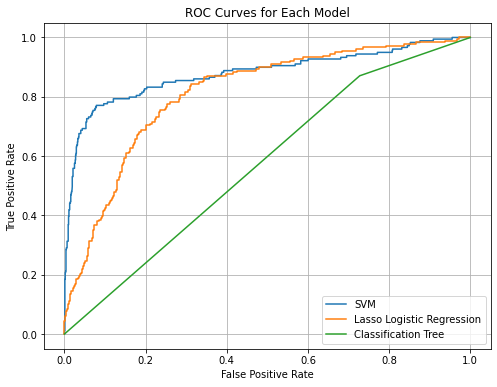

Figure 9. ROC Curves of All Models

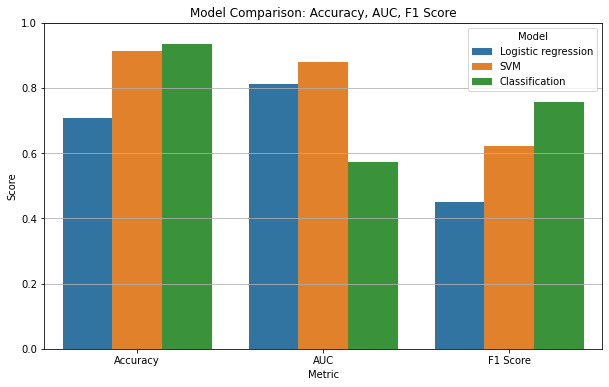

Figure 10. Model Comparison by Accuracy, AUC, and F1 Score

### 4. Churn Prediction Results
The churn prediction results on the test dataset were compared with the patterns observed in the training data to evaluate whether the model captured similar customer behaviors. Figure 11 presents the churn patterns observed in the training data, while Figure 12 displays the predicted churn distribution in the test data using the selected SVM model. 

A notable inversion was observed in the predicted churn patterns among international plan users. In the training dataset, customers without a voice mail plan but with international service had a higher churn rate (45.55%) compared to those with both plans (32.69%). However, in the test set predictions, churn was substantially higher among customers with both voice mail and international plans (59.28%), while churn among those without a voice mail plan dropped to 40.00%. This shift may reflect differences in the test data distribution, model behavior on unseen data, or potential limitations in how the model generalized from training patterns. Since true churn outcomes are not available for the test dataset, it is not possible to determine whether this prediction shift reflects actual customer behavior or a modeling bias.

Churn increased sharply among customers with five or more customer service calls, indicating dissatisfaction remains a strong churn driver. In both datasets, churn distribution was relatively stable across area codes, with only slight variation. In terms of service usage, churned customers in the test set exhibited slightly higher night and international minutes, consistent with patterns from the training data. Overall, the SVM model successfully captured the key churn-related behaviors, and the predicted churn profiles align well with the original training insights.

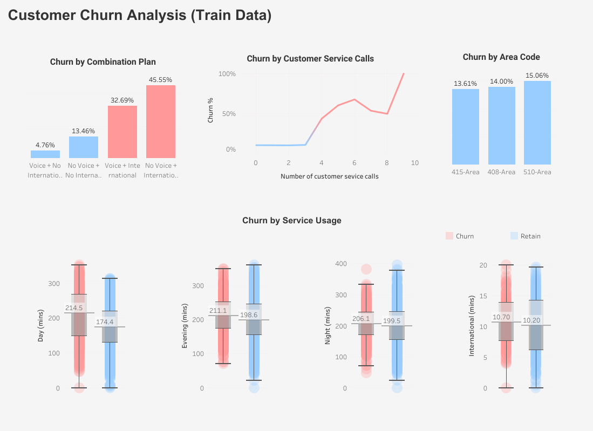

Figure 11. Churn Analysis of Training Data

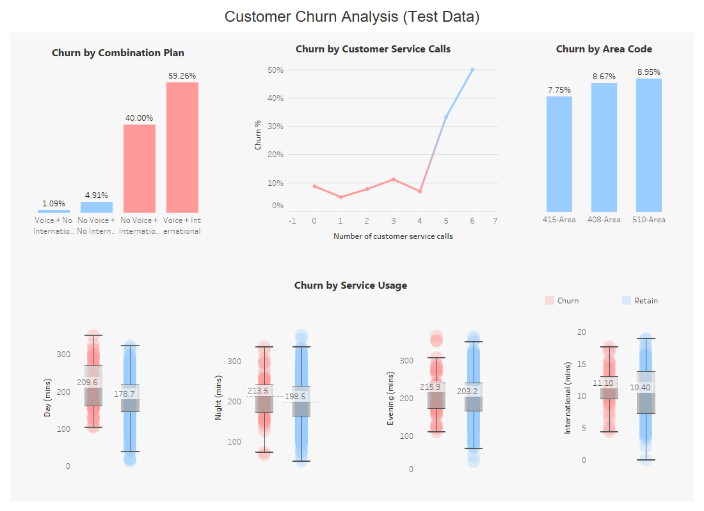

Figure 12. Churn Prediction Results on Test Data

### 5. Conclusion
The support vector machine (SVM) model with a polynomial kernel was selected as the final churn prediction model. It achieved the best overall balance between accuracy, AUC, and F1 score among the models tested.

When comparing churn prediction patterns between the training and test datasets, the model captured most of the key churn drivers consistently. Customers with frequent customer service interactions and those without additional service plans continued to show higher churn rates in both datasets. However, for customers with international plans, churn behavior shifted in the test data, with higher churn rates than observed during training. This indicates that while the model learned generalizable patterns, certain customer groups may have changed behaviors over time. The similarity between training and test results supports that the model identified meaningful drivers of churn, providing a reasonable basis for applying the predictions in customer retention strategies.

Although the model performed well overall, some limitations remain. The prediction patterns among customers with international plans showed differences between the training and test datasets. It is unclear whether these differences reflect actual behavioral shifts or model bias. Without true labels for the test data, model accuracy on this segment cannot be confirmed. Expanding the feature set, such as incorporating customer tenure, usage patterns, or payment history, may help the model better capture variations across different customer groups in future development.

